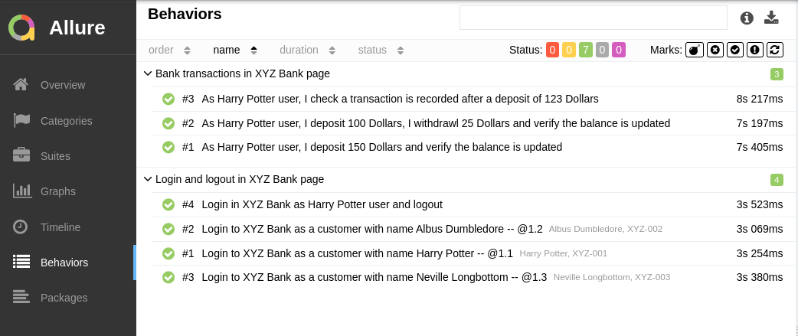

# XYZ Bank tests with Behave + Playwright

This project contains automated tests using Behave (BDD) and Playwright to test some XYZ bank user flows.

## Project Structure

```
nordh/
├── requirements.txt         # Project dependencies
├── behave.ini               # Behave configuration
├── README.md                # This file
├── config
    ├── browser.yaml         # config info related to Chrome browser
└── features/
    ├── *.feature            # Feature files where the tests are defined
    ├── environment.py       # Behave hooks (setup/teardown)
    └── steps/
        └── steps.py         # Test steps implementation
└── pages/
    ├── *.yaml               # Info related to the locators config
└── scripts/
    ├── run-tests.sh         # Script in order to run tests.
└── utils/
    ├── *.py                 # Files to support the steps implementation
```

## Installation

1. **Create virtual environment (recommended):**
```bash
python -m venv venv
source venv/bin/activate  # On Linux/Mac
# or
venv\Scripts\activate     # On Windows
```

2. **Install dependencies:**
```bash
pip install -r requirements.txt
```

3. **Install Playwright browsers:**
#### For chrome/chromium:
```bash
playwright install chromium
playwright install chrome
```
#### For other browsers:
```bash
playwright install firefox
playwright install webkit
```

## Running Tests

### Run all tests:
```bash
behave
```

### Run a specific feature:
```bash
behave features/bank_login.feature
```

### Run with specific tags:
You can run the test by test-id or any tag you want:
```bash
behave --tags=@test_id-XYZ-006
```
### Run tests from the run-tests.sh script:
This is useful for running them from a CI/CD pipeline.
```bash
./scripts/run-tests.sh
```
After running the tests with the script, you can check the results with allure plugin executing:
```bash
allure serve allure-results
```



## Technologies Used

- **Behave**: BDD framework for Python
- **Playwright**: Modern web automation tool
- **Python**: Programming language
